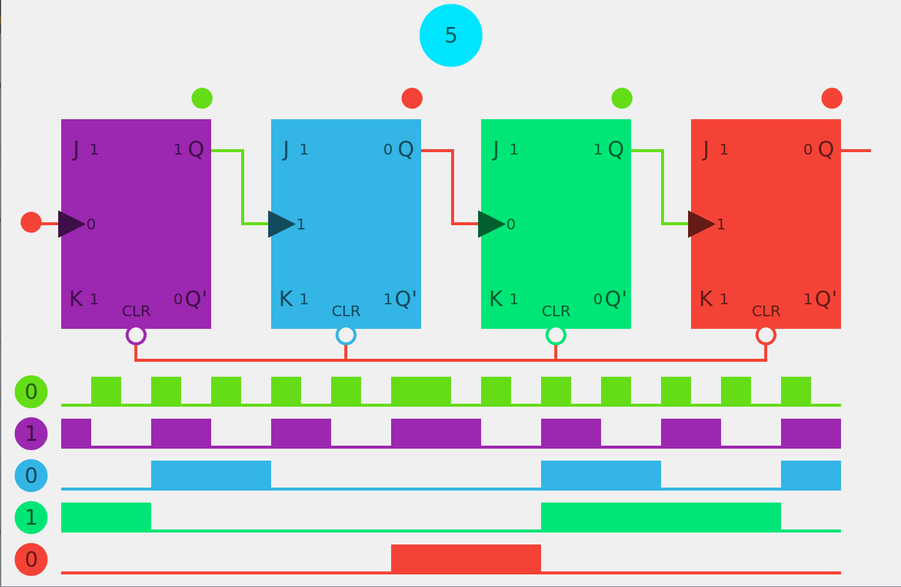
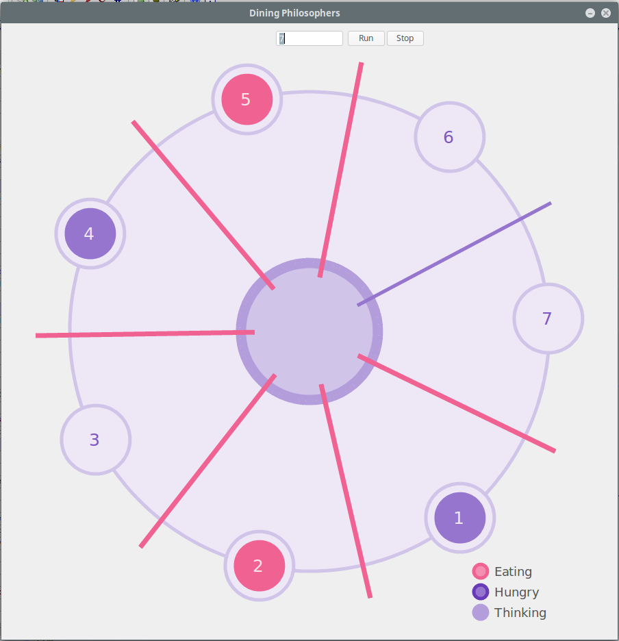

# Ultimate++ GUI Projects

 
> GUI programs written in Ultimate Plus Plus GUI toolkit for C++

## Programs  
### BCD Counter  

> A BCD Ripple counter emulated using JK Flip Flops  

  

Emulates edge triggered JK flip flops connected in a fashion to create a BCD Ripple Counter.  
Program is Object-Oriented and hasa a class for JK Flip Flop with appropriate triggers and states with option to reset.  
All flip flops reset on the collective value of `9` to create a BCD pattern.
The trigger of `0` or `1` is provided by left and right click. And since the flip flops are edge triggered, transition from values create a change in state rather than the value of transition itself.  

### Dining Philosophers  

> Dining Philosopher emulator  

  

Emulates classical threading and synchronization problem of dining philosophers using GUI.
You can pick the number of philosophers and start and stop the emulation.  
Picked up chopstick is rendered pink and otherwise it is purple, as shown in legend.

### Author
Areeb Jamal [@iamareebjamal](https://github.com/iamareebjamal)
